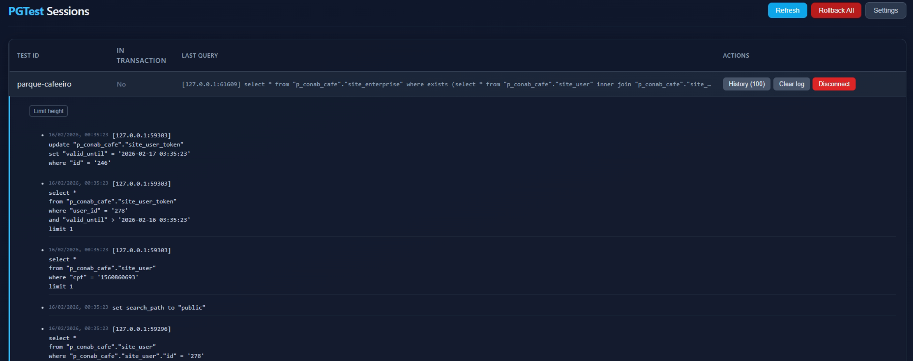
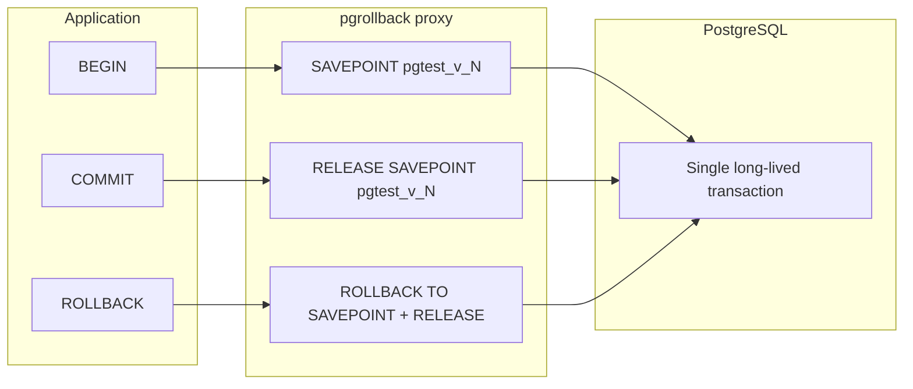

# pgrollback

**pgrollback** is a PostgreSQL transactional proxy designed for integration and functional testing.

It allows your application to execute real database writes while guaranteeing that nothing is permanently committed.

Tests run against a real PostgreSQL database. All changes are automatically rolled back.

---

# Why pgrollback exists

Integration tests modify the database.

Traditional solutions have limitations:

- resetting database between tests is slow
- using test databases is complex
- transactions only work per connection
- modern applications use multiple connections and connection pools

PostgreSQL transactions belong to a single connection.

pgrollback solves this by virtualizing transactions across multiple connections.

---

# Key features

- works with any PostgreSQL client
- supports connection pools
- supports multiple connections per test
- automatic rollback
- no cleanup scripts required
- no test database required
- no schema cloning required
- fully transparent to application
- uses real PostgreSQL engine

---

# Architecture

Application connects to pgrollback instead of PostgreSQL:

```
Application
    │
    ▼
pgrollback proxy
    │
    ▼
PostgreSQL
```

pgrollback opens one real transaction and keeps it alive.

Application COMMIT and ROLLBACK are converted to savepoint operations.

---

# Transaction virtualization example

Application code:

```sql
BEGIN;
INSERT INTO users(name) VALUES('Alice');
COMMIT;

BEGIN;
INSERT INTO users(name) VALUES('Bob');
ROLLBACK;
```

Internally pgrollback executes:

```sql
BEGIN;

SAVEPOINT pgtest_v_1;
INSERT INTO users(name) VALUES('Alice');
RELEASE SAVEPOINT pgtest_v_1;

SAVEPOINT pgtest_v_2;
INSERT INTO users(name) VALUES('Bob');
ROLLBACK TO SAVEPOINT pgtest_v_2;
RELEASE SAVEPOINT pgtest_v_2;
```

Guaranteed final database state after test ends or the server is closed:

```sql
ROLLBACK;
```

Database returns to original state.

---

# Realtime SQL log:

We included an GUI for check the queries runned against the proxy (everything running on just one port only)



# Run:

```
./bin/pgrollback --config config/pgrollback.yaml
```

---

# Configuration

Example config:

```yaml
postgres:
  host: localhost
  port: 5432
  database: mydb
  user: postgres
  password: password

proxy:
  listen_host: 0.0.0.0
  listen_port: 6432

logging:
  level: INFO
```

---

# Usage

Connect application to pgrollback:

```
host=localhost
port=6432
application_name=pgtest_test1
```

Run tests normally.

Reset sandbox manually:

```
pgtest rollback
```

---

# Language examples

## Python

```python
import psycopg

conn = psycopg.connect(
    host="localhost",
    port=6432,
    dbname="mydb",
    application_name="pgtest_test1"
)

conn.execute("INSERT INTO users VALUES (1)")
```

## Go

```go
connStr := "host=localhost port=6432 user=postgres dbname=mydb application_name=pgtest_test1"

db, _ := sql.Open("postgres", connStr)

db.Exec("INSERT INTO users VALUES (1)")
```

## Node.js

```js
const client = new Client({
  host: 'localhost',
  port: 6432,
  application_name: 'pgtest_test1'
})
```

## PHP

```php
$pdo = new PDO("pgsql:host=localhost;port=6432;dbname=mydb");
$pdo->exec("SET application_name='pgtest_test1'");
```

---

# pgtest commands

| Command | Description |
|--------|-------------|
| **pgtest rollback** | Rolls back the **entire** base transaction for this testID and starts a new one. Use to reset the sandbox to a clean state within the same test or before the next test. |
| **pgtest status** | Returns a result set: `test_id`, `active` (whether there is an active transaction), `level` (savepoint level), `created_at`. |
| **pgtest list** | Returns one row per session: `test_id`, `active`, `level`, `created_at`. |
| **pgtest cleanup** | Drops expired sessions (based on proxy timeout); returns a single number `cleaned`. |

Example: `db.Exec("pgtest rollback")` (or equivalent in your language) to reset the sandbox.

---

# CI example

```
pgrollback --config config.yaml &

run migrations

run tests

pgtest rollback

kill pgrollback
```

---

# Safety

Use only on test databases.

Do not use on production.

pgrollback keeps long transactions open.

---

# License

MIT

# Build

### Requirements: CGO and MinGW64 (Windows)

- Go 1.23+

```
go build -o bin/pgrollback ./cmd/pgtest
```

This project uses **cgo** for the SQL parser (`github.com/pganalyze/pg_query_go/v5`). On Windows you need a **64‑bit MinGW** toolchain so that `go build` can compile the C parts.

- **Install:** e.g. [MSYS2](https://www.msys2.org/) and then `pacman -S mingw-w64-x86_64-gcc` so that `C:\msys64\mingw64\bin` contains `x86_64-w64-mingw32-gcc.exe`.
- **Configure:** Run **setEnvironments.bat** before building (it adds `C:\msys64\mingw64\bin` to `PATH` and sets `CC`/`CXX` and `CGO_ENABLED=1`). In Cursor/VS Code, the workspace settings (`.vscode/settings.json`) can inject this environment into the integrated terminal so new terminals are ready for `go build`.
- **Verify:** In a terminal where the environment is set, run `where x86_64-w64-mingw32-gcc` and `go build ./pkg/sql/...`. The first cgo build may take 1–2 minutes.

Without a 64‑bit MinGW `gcc`, you may see errors like `sorry, unimplemented: 64-bit mode not compiled in`.

### Go / Makefile (cross-platform)

- **Build:** `go build -o bin/pgrollback ./cmd/pgtest` or `make build` (outputs `bin/pgrollback`).
- **Run:** `./bin/pgrollback` or `make run`. Optional first argument: path to config file; otherwise config is discovered (see [Configuration](#configuration)).

### Windows .bat scripts

- **setEnvironments.bat** — Sets up the Go environment (PATH, GOROOT, **MinGW64 for cgo**) so that `go build` and tests can run. Run it in a new shell before building, or use the “Go+MinGW” terminal profile in Cursor so the integrated terminal gets the same environment.
- **build.bat** — Calls `setEnvironments.bat`, then builds `bin\pgrollback.exe` with `-H windowsgui` (no console window; app lives in the system tray).
- **run.bat** — Calls `setEnvironments.bat`, then runs `bin\pgrollback.exe`.

#### Windows system tray (no console window)

On Windows, the main binary is built as a **GUI application** (no console window). When you start `pgrollback.exe`:

- A **tray icon** appears (near the clock) instead of a visible console.
- **Right‑click** the icon to:
  - **Open GUI** — launches your browser to the configured GUI URL (typically `http://<listen_host>:<listen_port>/`).
  - **Quit** — cleanly stops the proxy server and exits the app.

For debugging or logs from the console, you can still run:

- `go run ./cmd/pgtest`  
- or `go build -o bin/pgrollback.exe ./cmd/pgtest` (without `-H windowsgui`) and then run that binary from a terminal.

### Tests

- **test.bat** — Sets `PGTEST_CONFIG` (default `config\pgrollback.yaml` if unset), runs unit tests then integration tests (`-tags=integration`). Logs to `test_results_*.log`.
- **test-unit.bat** — Unit tests only; `-timeout 120s`, `-parallel 1` by default; prints a short report.
- **test-integration.bat** — Integration tests; requires a running PostgreSQL and valid config. Optional argument: test name for `-run`. Prints a short report.

Integration tests require a running PostgreSQL and a config (or environment variables) pointing at it.

## Quick start

1. **Install Go** (1.23+).
2. **Copy and edit the config** — e.g. copy `config/pgrollback.yaml` and set `postgres` (host, port, database, user, password) and `proxy` (listen_host, listen_port) to match your environment.
3. **Build and run the proxy:**  
   `make build && make run` (or on Windows: `build.bat` then `run.bat`).
4. **Point your tests at the proxy** — Use the proxy’s host and port as the database host/port in your test DSN. Set `application_name=pgtest_<testID>` so the proxy associates the connection with a session (see [Connecting from your tests](#connecting-from-your-tests)).

Your test process (e.g. PHP, Python, any PostgreSQL client) connects to the proxy; the proxy holds one long-lived transaction per testID and never commits it.

## Configuration

- **Config file:** By default the binary looks for `config/pgrollback.yaml` (relative to the working directory or next to the executable). Override with the `PGTEST_CONFIG` environment variable or by passing the config path as the first argument to the binary.
- **Structure:** The config has four main sections:
  - **postgres** — Connection to the real PostgreSQL: `host`, `port`, `database`, `user`, `password`, `session_timeout`.
  - **proxy** — How the proxy listens: `listen_host`, `listen_port`, `timeout`, `keepalive_interval`.
  - **logging** — `level` (DEBUG, INFO, WARN, ERROR), `file` (empty = stderr).
  - **test** — Optional test defaults: `schema`, `context_timeout`, `query_timeout`, `ping_timeout`.

The proxy speaks the PostgreSQL wire protocol. Clients connect to the proxy (using `proxy.listen_host` and `proxy.listen_port`); the proxy connects to the real database using the `postgres` settings and runs all commands inside a single transaction per session.

## pgtest commands

These are custom “queries” sent to the proxy (as a single statement). The proxy interprets them and does not forward them as normal SQL. The testID is taken from the connection’s `application_name` (`pgtest_<testID>`).


## TCL transformed into savepoint logic

The proxy intercepts transaction control statements and converts them into PostgreSQL savepoint operations so that the **base** transaction is never committed or rolled back from the application’s perspective; only logical “nested” transactions are.

- **BEGIN**  
  If there is no base transaction yet, the proxy ensures one is started. Then it sends **SAVEPOINT pgtest_v_N** to PostgreSQL, where **N** is the current savepoint level (1-based after the first BEGIN). The level is incremented for the next BEGIN. So: first BEGIN → base tx (if needed) + `SAVEPOINT pgtest_v_1`; second BEGIN → `SAVEPOINT pgtest_v_2`, and so on.

- **COMMIT**  
  Converted to **RELEASE SAVEPOINT pgtest_v_N** (release the current savepoint and decrement the level). If the level is already 0, no SQL is sent; the proxy returns success. The base transaction is **never** committed.

- **ROLLBACK** (plain `ROLLBACK`, not `ROLLBACK TO SAVEPOINT`)  
  If level > 0: the proxy sends **ROLLBACK TO SAVEPOINT pgtest_v_N; RELEASE SAVEPOINT pgtest_v_N** and decrements the level. If level = 0: no SQL is sent. So application ROLLBACK only undoes work since the last BEGIN (savepoint), not the whole session.

User-issued **SAVEPOINT**, **RELEASE SAVEPOINT**, and **ROLLBACK TO SAVEPOINT** are passed through and executed inside a guard so that a failure does not abort the main transaction.


