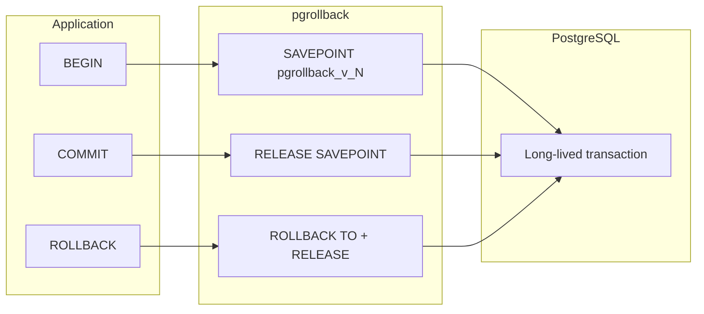

# pgrollback

PostgreSQL proxy for **integration and functional tests**: your app talks to a real database, but writes are not permanently committed. One long-lived backend transaction per test session; client `BEGIN` / `COMMIT` / `ROLLBACK` are mapped to savepoints.

---

## Contents

- [Why use it](#why-use-it)
- [Features](#features)
- [How it works](#how-it-works)
- [Quick start](#quick-start)
- [Run the proxy](#run-the-proxy)
- [Connect from tests](#connect-from-tests)
- [Special commands](#special-commands)
- [Build](#build)
- [Running tests](#running-tests)
- [Configuration](#configuration)
- [Transaction mapping](#transaction-mapping)
- [Language examples](#language-examples)
- [SQL log GUI](#sql-log-gui)
- [CI sketch](#ci-sketch)
- [Safety](#safety)
- [License](#license)

---

## Why use it

Integration tests change the database. Common pain points:

- Resetting or cloning the DB between tests is slow or heavy.
- A SQL transaction is **one connection**; apps use **pools and many connections**.

pgrollback keeps **one real PostgreSQL transaction** on the server side and exposes normal `BEGIN` / `COMMIT` / `ROLLBACK` to clients via savepoints, so multiple connections can share the same logical test session.

---

## Features

- Any PostgreSQL client (wire protocol).
- Connection pools and multiple connections per test ID.
- Automatic rollback when the session ends; no extra cleanup scripts.
- Real PostgreSQL execution (not mocked SQL).
- Web GUI to view the running queries and query history.

---

## How it works

```
Your app  →  pgrollback (proxy)  →  PostgreSQL
```

The proxy holds **one** long-lived transaction to Postgres. Application `COMMIT` does **not** commit that base transaction—it becomes `RELEASE SAVEPOINT` (and similar for `ROLLBACK`).

Example:

| Your app | On PostgreSQL (conceptually) |
|----------|--------------------------------|
| `BEGIN; INSERT …; COMMIT;` | `SAVEPOINT pgrollback_v_1; INSERT …; RELEASE SAVEPOINT pgrollback_v_1;` |
| `BEGIN; INSERT …; ROLLBACK;` | `SAVEPOINT …; INSERT …; ROLLBACK TO SAVEPOINT …; RELEASE …;` |

When the test finishes (or you issue a full rollback command), the sandbox is discarded—**no permanent writes**.

---

## Quick start

This is how you **use** pgrollback: run the proxy, aim your app at it, and keep each test run in its own sandbox.

### From a release (binary)

1. **Download** the pgrollback for your platform from **[pgrollback releases](https://github.com/asfixia/pgrollback/releases/)**, plus the **sample config** (or use [`config/pgrollback.yaml`](config/pgrollback.yaml) from this repository).

2. **Point the proxy at your database** — In the YAML, set the `postgres` block to the credentials of the PostgreSQL instance you use for **testing** (the real server the proxy will open the long-lived transaction on):

   ```yaml
   postgres:
     host: localhost
     port: 5432
     database: postgres
     user: postgres
     password: postgres
   ```

   Replace `host`, `port`, `database`, `user`, and `password` with your testing database. Your application does **not** connect here; only the proxy does.

3. **Change where the proxy listens** — Under `proxy`, keep or adjust `listen_host` and `listen_port`. For example:

   ```yaml
   proxy:
     listen_host: localhost
     listen_port: 5433
   ```

   Your app and tests will use **this** host and port as the “database” address.

4. **Start pgrollback** — Run the binary with your config, e.g. `./bin/pgrollback --config /path/to/pgrollback.yaml`.

5. **Configure your connection through the proxy** — Configure your PostgreSQL client to use `listen_host` and `listen_port` (e.g. `localhost` and `5433`). Traffic goes: **app → pgrollback → Postgres**. Work for that sandbox runs inside **one** server-side transaction; when the sandbox ends, it **rolls back**—no durable commits from that path.

6. **Separate sandboxes with `application_name`** — Set `application_name` to a stable value per logical test or worker, e.g. `pgrollback_<testId>`. The proxy treats each **distinct** `application_name` as a **different** sandbox (a **different** base transaction). Connections that share the same `application_name` share one sandbox; different names are isolated from each other. See [Connect from tests](#connect-from-tests).

### Building from source

To compile locally (Go, and on Windows MinGW for CGO), see [Build](#build). Then run the proxy the same way as in step 4, pointing `--config` at your edited YAML.

---

## Run the proxy

```bash
./bin/pgrollback --config config/pgrollback.yaml
```

**Windows (tray build):** `build.bat` produces a GUI-subsystem binary (tray icon, no console). For console logs, use `go run ./cmd/pgrollback` or build without `-H windowsgui`. Right‑click the tray icon → **Open GUI** / **Quit**.

---

## Connect from tests

Use the **proxy** port (not the raw Postgres port) and a stable **test id** via `application_name`:

```text
host = <proxy listen_host>
port = <proxy listen_port>
application_name = pgrollback_<your_test_id>
```

Same `test_id` across connections = same sandbox (shared logical transaction). Different `test_id` = isolated sandboxes.

To reset a sandbox without reconnecting, execute the SQL string `pgrollback rollback` (see [Special commands](#special-commands)).

---

## Special commands

Send as a **single statement** through the connection to the proxy (not forwarded as normal DDL/DML). The test id comes from `application_name`.

| Command | Purpose |
|--------|---------|
| `pgrollback rollback` | Roll back the **entire** base transaction for this test id and start a new one (reset sandbox). |
| `pgrollback status` | Result columns include `test_id`, `active`, `level`, `created_at`. |
| `pgrollback list` | One row per session (`test_id`, `active`, `level`, `created_at`). |
| `pgrollback cleanup` | Remove expired sessions; returns how many were cleaned. |
| `pgrollback disconnect` | (Used by tests/tools) disconnect flow for a session. |

Example: `db.Exec("pgrollback rollback")` in Go, or the equivalent in your stack.

---

## Build

### Requirements

- **Go 1.23+**
- **CGO** — This project uses `github.com/pganalyze/pg_query_go/v5` (C extension).

**Windows:** install a **64-bit MinGW** GCC (e.g. MSYS2: `pacman -S mingw-w64-x86_64-gcc`), then run **`setEnvironments.bat`** so `PATH`, `CC`, `CXX`, and `CGO_ENABLED=1` are set. See `.vscode/settings.json` for terminal integration.

**Single-file Windows executable (default):** On Windows, **`build.bat`**, **`make build`**, **`make test`**, and **`test.bat`** all use **`CGO_LDFLAGS=-static`** so MinGW links the pthread/GCC runtime into the binary. The resulting `pgrollback.exe` typically only depends on system DLLs (`KERNEL32.dll`, `msvcrt.dll`)—no `libwinpthread-1.dll` next to the exe. Test binaries under `%TEMP%` also avoid needing MinGW on `PATH` at run time.

**Dynamic MinGW link (one flag):** **`build.bat dynamic`** or **`make build DYNAMIC=1`** (and **`make test DYNAMIC=1`** if you use Make for tests) skip `-static` for faster links; then keep MinGW’s `bin` on `PATH` at run time, or copy `libwinpthread-1.dll` / `libgcc_s_seh-1.dll` next to the exe (`build.bat dynamic` copies them into `bin\`). A plain **`go build`** outside these scripts does not set `-static`; pass **`CGO_LDFLAGS=-static`** yourself if you want a single-file exe.

```bash
go build -o bin/pgrollback ./cmd/pgrollback
# or (Windows: static CGO by default)
make build
# or (Windows: dynamic CGO, faster link)
make build DYNAMIC=1
```

**CI:** [`.github/workflows/ci.yml`](.github/workflows/ci.yml) runs **`go test ./...`** (unit packages only; integration lives behind **`//go:build integration`**) then **`go test ./test/integration/... -tags=integration`** against the workflow’s Postgres service. On tag pushes it also builds Linux/Windows release binaries with **`CGO_LDFLAGS=-static`** where applicable. Actions use **`actions/checkout@v6`** and **`actions/setup-go@v6`** (Node.js 24 runtime).

Without a proper 64-bit `gcc`, you may see errors like `sorry, unimplemented: 64-bit mode not compiled in`.

---

## Running tests

### What runs where

| Suite | Packages | Needs PostgreSQL? | Build tag |
|-------|----------|-------------------|-----------|
| **Unit** | `./pkg/...`, `./internal/...`, `./tests/unit/...` | No (except some `tests/unit/proxy` tests that skip if DB missing) | *(none)* |
| **Integration** | `./test/integration/...` | **Yes** — real server + config | `-tags=integration` |

Integration tests start their own proxy via `TestMain`; they use **`PGROLLBACK_CONFIG`** (see `test.bat` / `internal/testutil.ConfigPath`) and **`PGROLLBACK_LISTEN_HOST` / `PGROLLBACK_LISTEN_PORT`** when overriding the proxy listen address.

### Windows (`test.bat`)

`test.bat` calls `setEnvironments.bat` first. Arguments can appear in any order.

| You type | What happens |
|----------|----------------|
| `test.bat` | Unit tests → integration tests; output in **`test_results_unit.log`** and **`test_results_integration.log`**. |
| `test.bat` `detailed` | Same suites, output on the **console** (no log files). |
| `test.bat` `unit` | Only unit tests. |
| `test.bat` `integration` | Only integration tests. |
| `test.bat` `integration` `TestProtectionAgainstAccidentalCommit` | One integration test (substring match for `-run`). |
| `test.bat` `integration` `detailed` `TestIsolationBetweenTestIDs` | One test, console output. |
| `test.bat` `all` | Same as default: unit + integration. |

If **`PGROLLBACK_LISTEN_PORT`** is already in use on `PGROLLBACK_LISTEN_HOST`, the script sets port to **`1` + original port** (e.g. `5433` → `15433`) and prints a message.

**Examples (integration test names from this repo):**

```bat
test.bat unit detailed
test.bat integration detailed TestProtectionAgainstAccidentalCommit
test.bat integration detailed TestTransactionSharing
test.bat integration TestMultiStatementMultiConnectionWorkflow
```

### Linux / macOS

```bash
go test -count=1 ./pkg/... ./internal/... ./tests/unit/...
go test -count=1 ./test/integration/... -tags=integration
# or
make test-unit      # pkg + internal only — add ./tests/unit/... for parity with test.bat
make test-integration
```

More detail (debugging, Cursor launch configs): **[TESTING.md](TESTING.md)**.

---

## Configuration

Default config path: **`config/pgrollback.yaml`** (or first CLI argument, or `pgrollback_CONFIG` env).

Main blocks:

- **`postgres`** — Real server: `host`, `port`, `database`, `user`, `password`, `session_timeout`, …
- **`proxy`** — Listen address: `listen_host`, `listen_port`, timeouts, keepalive.
- **`logging`** — `level`, optional `file`.
- **`test`** — Defaults used by tests/tools: `schema`, timeouts, etc.

Clients connect to **`proxy.listen_*`**; the proxy connects upstream using **`postgres.*`**.

---

## Transaction mapping

- **`BEGIN`** — Ensures a base transaction, then **`SAVEPOINT pgrollback_v_N`** (N increases for nested logical transactions).
- **`COMMIT`** — **`RELEASE SAVEPOINT pgrollback_v_N`**; the base transaction is **never** committed by the app.
- **`ROLLBACK`** (plain, not `ROLLBACK TO SAVEPOINT`) — **`ROLLBACK TO SAVEPOINT`** + **`RELEASE SAVEPOINT`** for the current user savepoint, or no-op at level 0.

User-defined **`SAVEPOINT` / `RELEASE` / `ROLLBACK TO SAVEPOINT`** are passed through with guarding so failures do not abort the whole session transaction.


```mermaid
flowchart LR
  subgraph app [Application]
    A[BEGIN]
    B[COMMIT]
    C[ROLLBACK]
  end
  subgraph proxy [pgrollback]
    A2[SAVEPOINT pgrollback_v_N]
    B2[RELEASE SAVEPOINT]
    C2[ROLLBACK TO + RELEASE]
  end
  subgraph db [PostgreSQL]
    TX[Long-lived transaction]
  end
  A --> A2 --> TX
  B --> B2 --> TX
  C --> C2 --> TX
```

---

## Language examples

**Python**

```python
import psycopg
conn = psycopg.connect(
    host="localhost", port=6432, dbname="mydb",
    application_name="pgrollback_test1",
)
conn.execute("INSERT INTO users VALUES (1)")
```

**Go**

```go
connStr := "host=localhost port=6432 user=postgres dbname=mydb application_name=pgrollback_test1"
db, _ := sql.Open("postgres", connStr)
db.Exec("INSERT INTO users VALUES (1)")
```

**Node.js**

```js
const client = new Client({
  host: 'localhost', port: 6432, application_name: 'pgrollback_test1',
})
```

**PHP**

```php
$pdo = new PDO("pgsql:host=localhost;port=6432;dbname=mydb");
$pdo->exec("SET application_name='pgrollback_test1'");
```

---

## SQL log GUI

The proxy can serve a small web UI (same listen port) to inspect queries:


---

## CI sketch

```bash
pgrollback --config config.yaml &
run migrations
run tests
pgrollback rollback   # optional explicit reset
kill pgrollback
```

---

## Safety

Use **only on test databases**. Do not point production traffic here—the proxy keeps long transactions open.

---

## License

Apache License 2.0 — see [LICENSE](LICENSE).
